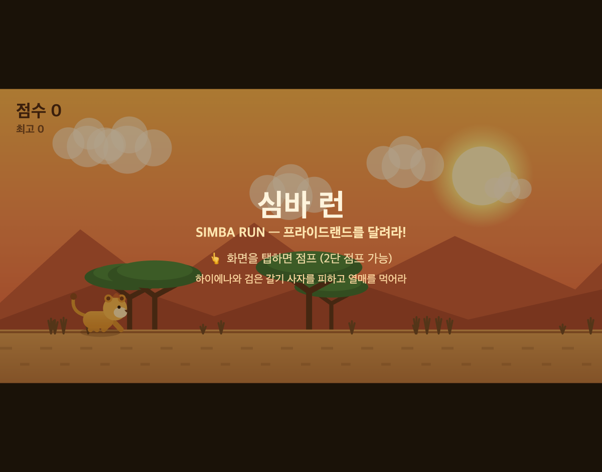

# 심바 런 (Simba Run) 🦁

라이온킹 테마의 가로모드 모바일 엔드리스 러너 게임. 슈퍼마리오와 같은 구성으로, 주인공 **심바**가 프라이드랜드를 왼쪽에서 오른쪽으로 계속 달립니다.



## 게임 방법

- **화면 탭 = 점프** (최대 **2단 점프**)
- **적을 피하세요**
  - 🐆 **하이에나** — 낮고 빠른 적
  - 🦁 **검은 갈기 성체 숫사자** — 크고 위협적인 적
- 🍑 **열매**를 먹으면 추가 점수
- 거리가 늘수록 속도가 빨라지고 적이 촘촘해집니다.

데스크톱에서는 **스페이스바 / ↑** 키로도 점프할 수 있습니다.

## 실행

외부 의존성 없는 단일 HTML 파일입니다. 브라우저로 열기만 하면 됩니다.

```bash
# 로컬 서버로 실행 (권장)
python3 -m http.server 8000
# 브라우저에서 http://localhost:8000 접속

# 또는 index.html 을 브라우저에서 바로 열기
```

## 기술

- 순수 HTML5 Canvas + Vanilla JavaScript (프레임워크·에셋 없음)
- 캐릭터·배경 전부 Canvas 벡터 드로잉으로 렌더링
- 가로모드 최적화, 세로일 때 회전 안내, `devicePixelRatio` 대응
- 최고 점수는 `localStorage`에 저장

## 라이선스

개인 학습/취미 프로젝트.
